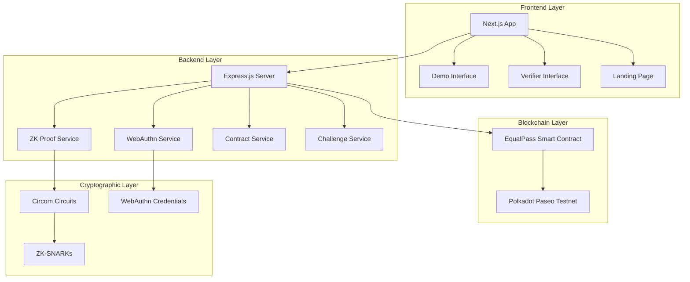
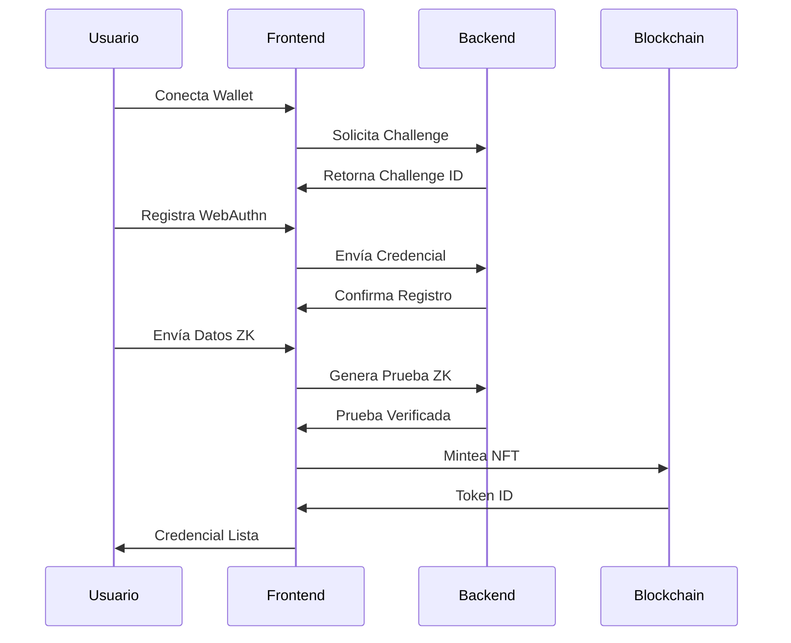
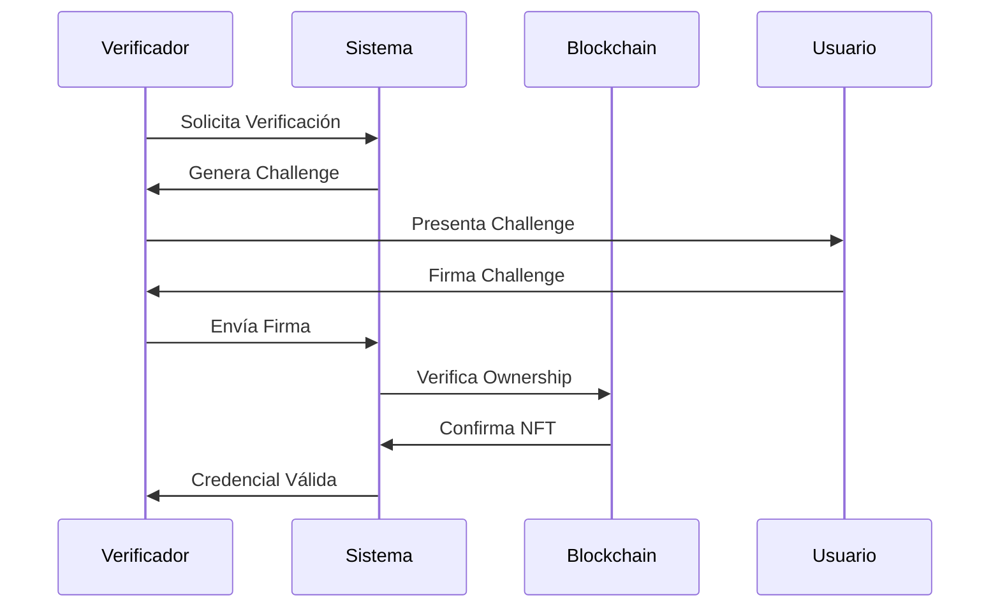
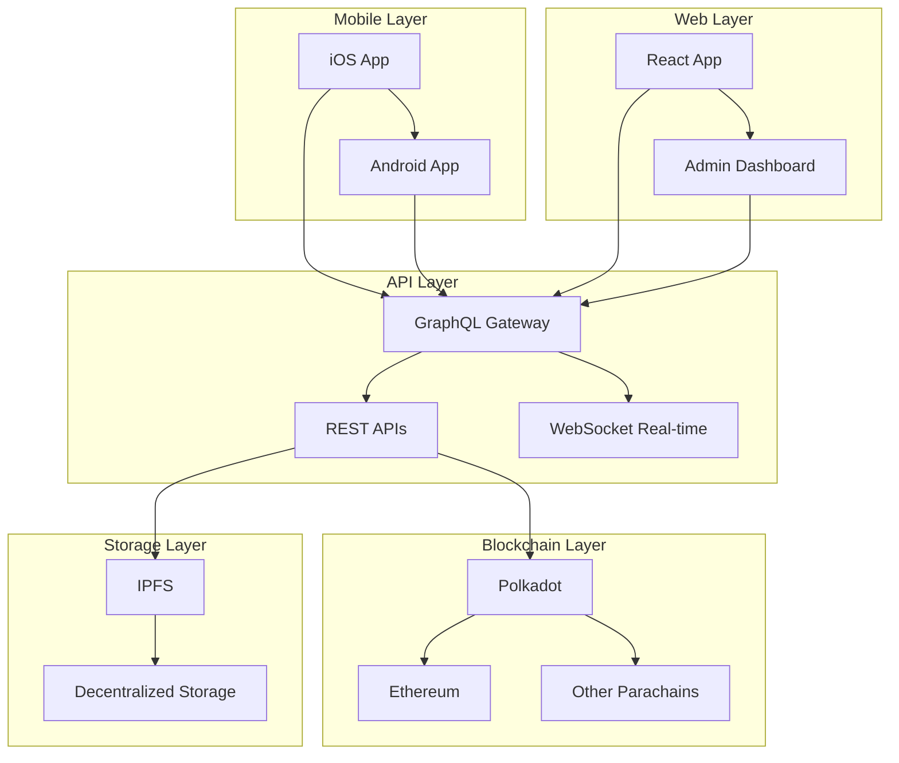

# EqualPass Identity System - Documentación Completa

## 📋 Índice

1. [Resumen Ejecutivo](#resumen-ejecutivo)
2. [Arquitectura del Sistema](#arquitectura-del-sistema)
3. [Tecnologías Utilizadas](#tecnologías-utilizadas)
4. [Componentes Principales](#componentes-principales)
5. [Flujo de Implementación](#flujo-de-implementación)
6. [Configuración y Despliegue](#configuración-y-despliegue)
7. [Guías de Uso](#guías-de-uso)
8. [API Documentation](#api-documentation)
9. [Smart Contracts](#smart-contracts)
10. [Frontend Components](#frontend-components)
11. [Seguridad](#seguridad)
12. [Testing](#testing)
13. [Troubleshooting](#troubleshooting)
14. [Roadmap](#roadmap)

---

## 🎯 Resumen Ejecutivo

**EqualPass Identity System** es una solución completa de identidad digital que combina **Zero-Knowledge Proofs (ZK)**, **WebAuthn**, y **NFTs** para crear un sistema de verificación de credenciales estudiantiles seguro y preservando la privacidad.

### Características Principales

- ✅ **Verificación de Identidad sin Revelar Datos**: Usando ZK-SNARKs
- ✅ **Autenticación Biométrica**: WebAuthn con dispositivos compatibles
- ✅ **NFTs como Credenciales**: Tokens ERC-721 en Polkadot Paseo Testnet
- ✅ **Interfaz Moderna**: Frontend React/Next.js responsivo
- ✅ **Verificador Independiente**: Sistema para verificar credenciales
- ✅ **Conectividad Multi-Wallet**: MetaMask y otras wallets compatibles

### Casos de Uso

1. **Verificación de Estudiantes**: Demostrar estatus estudiantil sin revelar información personal
2. **Acceso a Servicios**: Utilizar credenciales verificadas para acceder a descuentos, bibliotecas, etc.
3. **Eventos Académicos**: Verificación de participantes en conferencias y eventos
4. **Sistemas de Votación**: Verificar elegibilidad sin comprometer privacidad

---

## 🏗️ Arquitectura del Sistema



### Flujo de Datos Principal

1. **Usuario** se conecta al frontend con su wallet
2. **Frontend** solicita al backend generar pruebas ZK
3. **Backend** procesa datos con circuitos Circom
4. **ZK Service** genera SNARKs preservando privacidad
5. **WebAuthn** autentica la identidad del usuario
6. **Smart Contract** mintea NFT verificado en blockchain
7. **Verifier** puede validar credenciales independientemente

---

## 🔧 Tecnologías Utilizadas

### Frontend Stack
- **Framework**: Next.js 14+ con TypeScript
- **UI Components**: shadcn/ui + Radix UI
- **Styling**: Tailwind CSS
- **Wallet Integration**: Wagmi + RainbowKit
- **State Management**: React Hooks + Context

### Backend Stack
- **Runtime**: Node.js con Express.js
- **WebAuthn**: @simplewebauthn/server
- **ZK Proofs**: SnarkJS
- **Blockchain**: Ethers.js v6
- **CORS**: Cross-origin resource sharing habilitado

### Blockchain & Crypto
- **Network**: Polkadot Paseo Asset Hub Testnet
- **Smart Contract**: Solidity ^0.8.28
- **Development**: Hardhat + @parity/hardhat-polkadot
- **ZK Circuits**: Circom 2.0.0
- **Token Standard**: ERC-721 (NFTs)

### DevOps & Tools
- **Build Tool**: Next (para desarrollo rápido)
- **Package Manager**: npm
- **Testing**: Hardhat test suite
- **Code Quality**: ESLint + TypeScript
- **Version Control**: Git

---

## 🧩 Componentes Principales

### 1. Frontend Application (`/equalpass-system`)

#### **Páginas Principales**

- **`app/page.tsx`**: Landing page con navegación principal
- **`app/demo/page.tsx`**: Interface para estudiantes (generación de credenciales)
- **`app/verifier/page.tsx`**: Interface para verificadores

#### **Componentes Clave**

- **`components/mint/mint-card.tsx`**: Card para mintear NFTs
- **`components/verifier/verifier-form.tsx`**: Formulario de verificación
- **`components/ui/BackButton.tsx`**: Navegación mejorada
- **`components/test/test-contract.tsx`**: Herramientas de testing

#### **Servicios y APIs**

- **`lib/equal-pass-api.ts`**: Cliente para comunicación con backend
- **`lib/contract.ts`**: Configuración de contratos inteligentes
- **`lib/api-config.ts`**: Configuración de endpoints

### 2. Backend Server (`/backend`)

#### **Estructura Modular**

```
backend/
├── server-modular.js          # Servidor principal
├── config/
│   ├── app.js                 # Configuración de aplicación
│   └── contract.js            # Configuración de contrato
├── services/
│   ├── challenge.service.js   # Gestión de desafíos
│   ├── zk.service.js         # Procesamiento ZK
│   └── contract.service.js    # Interacción blockchain
├── routes/
│   ├── auth.js               # Rutas WebAuthn
│   ├── verification.js       # Rutas de verificación
│   └── challenge.js          # Rutas de desafíos
└── circuits/                 # Circuitos ZK compilados
```

#### **Endpoints Principales**

- **WebAuthn**: `/api/webauthn/register`, `/api/webauthn/authenticate`
- **ZK Proofs**: `/api/verify-zk`, `/api/eligible`
- **NFT**: `/api/mint`, `/api/metadata/{tokenId}`
- **Verification**: `/api/generate-challenge`, `/api/verify-ownership`

### 3. Smart Contracts (`/contracts`)

#### **Contrato Principal: EqualPassIdentityBadge.sol**

```solidity
contract EqualPassIdentityBadge is ERC721, AccessControl {
    // Tipos de badges disponibles
    enum BadgeType { STUDENT, FACULTY, ADMIN }
    
    // Estructura de metadata
    struct Badge {
        BadgeType badgeType;
        string securityLevel;
        uint256 issuedAt;
        bytes32 dataHash;
    }
    
    // Funciones principales
    function mintBadge(address to, BadgeType badgeType, string memory securityLevel, bytes32 dataHash) external;
    function getBadgeInfo(uint256 tokenId) external view returns (Badge memory);
    function getTokensByOwner(address owner) external view returns (uint256[] memory);
}
```

#### **Características del Contrato**

- **Size-Optimized**: Implementaciones mínimas para evitar el límite de 100KB
- **Access Control**: Sistema de roles personalizado
- **ERC-721 Compatible**: Estándar NFT con metadata extendida
- **Gas Efficient**: Optimizado para costos bajos de transacción

### 4. ZK Circuits (`/backend/circuits`)

#### **Circuito Principal: eligibility_student.circom**

```circom
template StudentEligibility() {
    signal input studentStatus;     // 1 = activo, 0 = inactivo
    signal input enrollmentYear;    // año de matrícula (público)
    signal input universityHash;    // hash de la universidad
    signal input userSecret;        // secreto del usuario
    
    signal output eligible;
    
    // Lógica de elegibilidad
    eligible <== studentStatus;
}
```

#### **Archivos Generados**

- **`eligibility_student.wasm`**: Circuito compilado
- **`eligibility_student.zkey`**: Clave de verificación
- **`verification_key.json`**: Clave pública para verificación

---

## 🔄 Flujo de Implementación

### Proceso Completo de Verificación de Identidad

#### **Fase 1: Configuración Inicial**
1. Usuario conecta wallet (MetaMask/compatible)
2. Sistema verifica red (Polkadot Paseo Testnet)
3. Backend genera challenge único
4. Frontend inicializa WebAuthn

#### **Fase 2: Generación de Credenciales**
1. **Registro WebAuthn**: 
   - Usuario registra biométrica/PIN
   - Sistema almacena credencial pública
2. **Input ZK**: 
   - Usuario proporciona datos estudiantiles
   - Sistema genera hash de universidad
3. **Proof Generation**:
   - Circuito procesa inputs privados
   - Genera SNARK preservando privacidad
4. **Verification**:
   - Backend verifica prueba ZK
   - Retorna elegibilidad sin exponer datos

#### **Fase 3: Emisión de NFT**
1. **Contract Interaction**:
   - Frontend llama función `mintBadge`
   - Smart contract valida caller
2. **Minting Process**:
   - NFT se mintea con metadata verificada
   - Token ID único asignado
3. **Wallet Integration**:
   - NFT automáticamente visible en MetaMask
   - Metadata incluye nivel de seguridad

#### **Fase 4: Verificación Independiente**
1. **Verifier Access**:
   - Terceros acceden al verificador
   - No requieren acceso al sistema principal
2. **Challenge Generation**:
   - Verificador genera desafío criptográfico
   - Usuario firma con wallet
3. **Ownership Proof**:
   - Sistema verifica propiedad del NFT
   - Retorna información de credencial válida

### Diagramas de Flujo

#### **Flujo de Registro de Usuario**


#### **Flujo de Verificación**


---

## ⚙️ Configuración y Despliegue

### Prerequisitos del Sistema

```bash
# Node.js (versión 18+)
node --version

# npm (incluido con Node.js)
npm --version

# Git para clonar repositorios
git --version
```

### Configuración del Entorno

#### **1. Variables de Entorno**

**Backend (`.env`)**:
```env
# Red de desarrollo
NETWORK=passetHubTestnet
RPC_URL=https://testnet-passet-hub-eth-rpc.polkadot.io

# Clave privada (sin 0x)
PRIVATE_KEY=tu_clave_privada_aqui

# Configuración del servidor
PORT=3001
CORS_ORIGIN=http://localhost:3000

# Configuración de circuitos ZK
CIRCUITS_PATH=./circuits
PTAU_FILE=pot12_final.ptau
```

**Frontend (`.env.local`)**:
```env
# API del backend
NEXT_PUBLIC_API_URL=http://localhost:3001/api
NEXT_PUBLIC_NFT_BASE=http://localhost:3001

# Red de blockchain
NEXT_PUBLIC_CHAIN_ID=420420422
NEXT_PUBLIC_CHAIN_NAME=Paseo PassetHub
```

#### **2. Configuración de Red**

**Hardhat Configuration (`contracts/hardhat.config.ts`)**:
```typescript
const config: HardhatUserConfig = {
  solidity: {
    version: "0.8.28",
    settings: {
      optimizer: { enabled: true, runs: 1 },
      viaIR: true
    }
  },
  networks: {
    passetHubTestnet: {
      polkavm: true,
      url: "https://testnet-passet-hub-eth-rpc.polkadot.io",
      accounts: [process.env.PRIVATE_KEY!],
      chainId: 420420422
    }
  }
};
```

### Instalación Paso a Paso

#### **1. Clonar Repositorio**
```bash
git clone [repository-url]
cd equalpass-hackathon/install
```

#### **2. Backend Setup**
```bash
cd backend
npm install

# Configurar variables de entorno
cp .env.example .env
# Editar .env con tus valores

# Iniciar servidor de desarrollo
npm run dev
```

#### **3. Smart Contracts**
```bash
cd ../contracts
npm install

# Configurar clave privada
npx hardhat vars set PRIVATE_KEY
# Introducir clave SIN 0x prefix

# Compilar contratos
npx hardhat compile

# Desplegar en testnet
npx hardhat ignition deploy ./ignition/modules/DeployEqualPass.ts --network passetHubTestnet
```

#### **4. Frontend Setup**
```bash
cd ../equalpass-system
npm install

# Configurar variables de entorno
cp .env.local.example .env.local
# Editar con URLs del backend

# Iniciar desarrollo
npm run dev
```

### Obtener Tokens de Testnet

1. **Visitar Faucet**: https://faucet.polkadot.io/?parachain=1111
2. **Conectar Wallet**: MetaMask con red Paseo configurada
3. **Solicitar Tokens**: Recibir PAS para transacciones

### Verificación de Instalación

```bash
# Verificar backend (puerto 3001)
curl http://localhost:3001/api/health

# Verificar frontend (puerto 3000)
curl http://localhost:3000

# Verificar contratos desplegados
npx hardhat verify --network passetHubTestnet [CONTRACT_ADDRESS]
```

---

## 📖 Guías de Uso

### Para Estudiantes (Demo Interface)

#### **Paso 1: Conectar Wallet**
1. Abre la aplicación en `http://localhost:3000`
2. Navega a "Demo"
3. Haz clic en "Conectar Wallet"
4. Autoriza la conexión en MetaMask
5. Asegúrate de estar en la red Paseo Testnet

#### **Paso 2: Registro WebAuthn**
1. Haz clic en "Configurar WebAuthn"
2. Autoriza el uso de biométrica/PIN en tu dispositivo
3. Completa el registro de credenciales
4. Verifica que aparezca "✅ WebAuthn configurado"

#### **Paso 3: Generar Prueba ZK**
1. **Completa el formulario con datos estudiantiles**:
   - Estado de estudiante: "Activo"
   - Año de matriculación: ej. "2025"
   - Hash de universidad: código único
   - Secreto de usuario: clave personal
2. **Haz clic en "Generar Prueba ZK + WebAuthn"**
3. **Autoriza la autenticación biométrica**
4. **Espera la verificación ZK** (puede tomar unos segundos)

#### **Paso 4: Mintear NFT**
1. Una vez verificada la prueba, aparecerá el botón "Mintear Badge"
2. Haz clic y autoriza la transacción en MetaMask
3. Espera la confirmación en blockchain
4. El Token ID aparecerá al completarse

#### **Paso 5: Agregar NFT a Wallet**
1. **Tip**: Asegúrate de que tu wallet esté desbloqueada
2. Haz clic en "🎫 Obtener Mi NFT"
3. El NFT se agregará automáticamente a MetaMask
4. Verifica en la sección "NFTs" de tu wallet

### Para Verificadores

#### **Acceso al Verificador**
1. Navega a `/verifier` en la aplicación
2. No requiere conexión de wallet propia
3. Interface independiente para verificación

#### **Verificación por Dirección**
1. **Selecciona "Verificar por Dirección"**
2. **Opción A - Manual**: Ingresa dirección de wallet manualmente
3. **Opción B - Conectar**: Haz clic en "Conectar Wallet" para autocompletar
4. **Haz clic en "Verificar"**
5. **Revisa resultados**:
   - ✅ Credencial válida: Muestra badges encontrados
   - ❌ Sin credenciales: Dirección no tiene badges

#### **Información de Verificación**
Los resultados incluyen:
- **Address**: Dirección verificada
- **Badges**: Lista de credenciales
- **Token ID**: Identificador único
- **Badge Type**: Tipo de credencial (STUDENT/FACULTY/ADMIN)
- **Security Level**: Nivel de verificación (HIGH/MEDIUM/LOW)
- **Issued At**: Timestamp de emisión

### Para Desarrolladores

#### **Testing Local**
```bash
# Test de contratos
cd contracts
npx hardhat test

# Test de circuitos ZK
cd ../backend/circuits
npm run test-circuit

# Test de API
cd ..
npm run test

# Test de frontend
cd ../equalpass-system
npm run test
```

#### **Debugging**
```bash
# Logs del backend
cd backend
npm run dev -- --verbose

# Logs de blockchain
npx hardhat console --network passetHubTestnet

# Verificar estado de transacciones
npx hardhat run scripts/verify-deployment.js
```

---

## 🔌 API Documentation

### Authentication Endpoints

#### **POST `/api/webauthn/register/begin`**
Inicia el proceso de registro WebAuthn.

**Request Body**:
```json
{
  "username": "string",
  "userDisplayName": "string"
}
```

**Response**:
```json
{
  "challenge": "base64-encoded-challenge",
  "user": {
    "id": "user-id",
    "name": "username",
    "displayName": "User Display Name"
  },
  "pubKeyCredParams": [...],
  "timeout": 60000
}
```

#### **POST `/api/webauthn/register/complete`**
Completa el registro WebAuthn.

**Request Body**:
```json
{
  "credential": "webauthn-credential-object",
  "challenge": "original-challenge"
}
```

**Response**:
```json
{
  "verified": true,
  "registrationInfo": {
    "credentialPublicKey": "...",
    "credentialID": "...",
    "counter": 0
  }
}
```

### ZK Proof Endpoints

#### **POST `/api/verify-zk`**
Verifica una prueba Zero-Knowledge.

**Request Body**:
```json
{
  "proof": {
    "pi_a": ["...", "...", "1"],
    "pi_b": [["...", "..."], ["...", "..."], ["1", "0"]],
    "pi_c": ["...", "...", "1"],
    "protocol": "groth16",
    "curve": "bn128"
  },
  "publicSignals": ["1", "2025", "12345"]
}
```

**Response**:
```json
{
  "isValid": true,
  "sessionId": "unique-session-id"
}
```

#### **POST `/api/eligible`**
Verifica elegibilidad basada en evidencia ZK.

**Request Body**:
```json
{
  "evidence": "zk-proof-evidence",
  "userAddress": "0x..."
}
```

**Response**:
```json
{
  "sessionId": "session-id",
  "eligible": true
}
```

### Blockchain Endpoints

#### **POST `/api/mint`**
Mintea un nuevo NFT badge.

**Request Body**:
```json
{
  "userAddress": "0x...",
  "badgeType": 0,
  "securityLevel": "HIGH",
  "sessionId": "verified-session-id"
}
```

**Response**:
```json
{
  "success": true,
  "txHash": "0x...",
  "tokenId": "123"
}
```

#### **GET `/api/metadata/{tokenId}`**
Obtiene metadata de un NFT.

**Response**:
```json
{
  "name": "EqualPass Student Badge #123",
  "description": "Verified student credential",
  "image": "https://api.example.com/nft/123.png",
  "attributes": [
    {"trait_type": "Badge Type", "value": "STUDENT"},
    {"trait_type": "Security Level", "value": "HIGH"},
    {"trait_type": "Issued At", "value": "2025-01-01"}
  ]
}
```

### Verification Endpoints

#### **POST `/api/generate-challenge`**
Genera un desafío para verificación.

**Request Body**:
```json
{
  "verifierName": "Acme University",
  "purpose": "Library Access"
}
```

**Response**:
```json
{
  "challengeId": "unique-challenge-id",
  "message": "Sign this message to verify ownership",
  "expiresAt": "2025-01-01T12:00:00Z"
}
```

#### **POST `/api/verify-ownership`**
Verifica propiedad de credenciales.

**Request Body**:
```json
{
  "challengeId": "challenge-id",
  "signature": "0x...",
  "walletAddress": "0x...",
  "verifierName": "Acme University"
}
```

**Response**:
```json
{
  "verified": true,
  "badges": [
    {
      "tokenId": "123",
      "badgeType": "STUDENT",
      "securityLevel": "HIGH",
      "issuedAt": "2025-01-01T00:00:00Z"
    }
  ]
}
```

### Contract Information

#### **GET `/api/contract-info`**
Obtiene información del contrato desplegado.

**Response**:
```json
{
  "address": "0x60E9b9fe1fb298299534a8aBafB628B1279DaaD3",
  "network": "Paseo Asset Hub Testnet",
  "chainId": 420420422,
  "blockExplorer": "https://blockscout-passet-hub.parity-testnet.parity.io"
}
```

---

## 📜 Smart Contracts

### EqualPassIdentityBadge Contract

#### **Funciones Principales**

##### **mintBadge**
```solidity
function mintBadge(
    address to,
    BadgeType badgeType,
    string memory securityLevel,
    bytes32 dataHash
) external onlyRole(MINTER_ROLE)
```

Mintea un nuevo badge NFT.

**Parámetros**:
- `to`: Dirección del receptor
- `badgeType`: Tipo de badge (STUDENT=0, FACULTY=1, ADMIN=2)
- `securityLevel`: Nivel de seguridad ("HIGH", "MEDIUM", "LOW")
- `dataHash`: Hash de los datos verificados

##### **getBadgeInfo**
```solidity
function getBadgeInfo(uint256 tokenId) 
    external view returns (Badge memory)
```

Obtiene información completa de un badge.

##### **getTokensByOwner**
```solidity
function getTokensByOwner(address owner) 
    external view returns (uint256[] memory)
```

Lista todos los tokens de un propietario.

##### **tokenURI**
```solidity
function tokenURI(uint256 tokenId) 
    public view override returns (string memory)
```

Retorna URI de metadata del token.

#### **Eventos**

```solidity
event BadgeMinted(
    address indexed to,
    uint256 indexed tokenId,
    BadgeType badgeType,
    string securityLevel
);

event RoleGranted(
    bytes32 indexed role,
    address indexed account,
    address indexed sender
);
```

#### **Roles y Permisos**

```solidity
bytes32 public constant MINTER_ROLE = keccak256("MINTER_ROLE");
bytes32 public constant DEFAULT_ADMIN_ROLE = 0x00;
```

- **MINTER_ROLE**: Puede mintear nuevos badges
- **DEFAULT_ADMIN_ROLE**: Administrador del contrato

#### **Estructuras de Datos**

```solidity
enum BadgeType { STUDENT, FACULTY, ADMIN }

struct Badge {
    BadgeType badgeType;
    string securityLevel;
    uint256 issuedAt;
    bytes32 dataHash;
}
```

### Optimizaciones del Contrato

#### **Size Optimization**
- **Custom ERC721**: Implementación mínima vs OpenZeppelin
- **Custom AccessControl**: Funcionalidad reducida pero funcional
- **Bytecode Limit**: Optimizado para estar bajo 100KB

#### **Gas Optimization**
```solidity
// Configuración de optimización en Hardhat
solidity: {
  version: "0.8.28",
  settings: {
    optimizer: { enabled: true, runs: 1 },
    viaIR: true
  }
}
```

### Deployment Information

**Contract Address**: `0x60E9b9fe1fb298299534a8aBafB628B1279DaaD3`  
**Network**: Polkadot Paseo Asset Hub Testnet  
**Chain ID**: 420420422  
**Explorer**: https://blockscout-passet-hub.parity-testnet.parity.io

---

## 🎨 Frontend Components

### Páginas Principales

#### **Landing Page (`app/page.tsx`)**
```tsx
// Características principales:
- Hero section con gradientes animados
- Navegación a Demo y Verifier
- Logo EqualPass integrado
- Responsive design
- Animaciones con Tailwind CSS
```

#### **Demo Page (`app/test/page.tsx`)**
```tsx
// Funcionalidades:
- Conexión dinámica de wallet
- Registro WebAuthn integrado
- Generación de pruebas ZK
- Minting de NFTs
- Feedback visual en tiempo real
- Tip box para experiencia de usuario
```

#### **Verifier Page (`app/verifier/page.tsx`)**
```tsx
// Capacidades:
- Verificación independiente
- Soporte para múltiples métodos de input
- Resultados detallados de verificación
- Interface limpia y funcional
```

### Componentes Reutilizables

#### **MintCard Component**
```tsx
// Ubicación: components/mint/mint-card.tsx
// Funcionalidad:
- Selector de tipo de badge
- Integración con Rainbow Kit
- Manejo de estados de transacción
- Validación de red
- Feedback visual de progreso
```

#### **VerifierForm Component**
```tsx
// Ubicación: components/verifier/verifier-form.tsx
// Características:
- Formularios con validación
- Conexión opcional de wallet
- Resultados estructurados
- Manejo de errores elegante
- Loading states
```

#### **BackButton Component**
```tsx
// Ubicación: components/ui/BackButton.tsx
// Mejoras implementadas:
- Navegación programática vs historial del navegador
- Redirección consistente a página principal
- Accesibilidad mejorada
- Iconografía intuitiva
```

### UI/UX Improvements

#### **Design System**
- **Color Palette**: Azul/Cyan/Emerald para identidad cohesiva
- **Typography**: Geist font para legibilidad moderna
- **Spacing**: Sistema consistente basado en Tailwind
- **Components**: shadcn/ui para consistencia

#### **User Experience**
- **Progressive Disclosure**: Información revelada gradualmente
- **Loading States**: Feedback visual durante operaciones
- **Error Handling**: Mensajes claros y accionables
- **Responsive Design**: Funcional en móvil y desktop

#### **Accessibility**
- **ARIA Labels**: Etiquetas descriptivas para screen readers
- **Keyboard Navigation**: Navegación completa por teclado
- **Color Contrast**: Cumple estándares WCAG
- **Focus Management**: Estados de foco visibles y lógicos

### State Management

#### **Local State (React Hooks)**
```tsx
// Estados principales manejados:
- Conexión de wallet
- Progreso de WebAuthn
- Estados de carga
- Datos de formularios
- Resultados de verificación
```

#### **Global State (Context)**
```tsx
// Contextos implementados:
- WagmiConfig para blockchain
- Web3AuthContext para autenticación
- Toast context para notificaciones
```

### API Integration

#### **equal-pass-api.ts**
```typescript
// Cliente centralizado para:
- Comunicación con backend
- Manejo de errores HTTP
- Transformación de datos
- Retry logic para requests fallidos
- Type safety con TypeScript
```

#### **MetaMask Helpers**
```typescript
// Utilidades para:
- Cambio automático de red
- Agregado de NFTs a wallet
- Detección de wallet instalada
- Manejo de errores específicos de MetaMask
```

---

## 🔒 Seguridad

### Medidas de Seguridad Implementadas

#### **1. Zero-Knowledge Proofs**
- **Preservación de Privacidad**: Datos sensibles nunca expuestos
- **Verificación Criptográfica**: Pruebas matemáticamente sólidas
- **No Repudiation**: Imposible falsificar pruebas válidas

#### **2. WebAuthn Security**
- **Autenticación Biométrica**: Factores únicos e intransferibles
- **Hardware Security**: Llaves almacenadas en secure enclaves
- **Anti-Phishing**: Vinculación a dominio específico

#### **3. Smart Contract Security**
- **Access Control**: Roles granulares para funciones críticas
- **Input Validation**: Validación estricta de parámetros
- **Reentrancy Protection**: Guards contra ataques conocidos

#### **4. Frontend Security**
- **XSS Prevention**: Sanitización de inputs
- **CSRF Protection**: Tokens anti-falsificación
- **Content Security Policy**: Headers de seguridad

#### **5. Backend Security**
- **CORS Configuration**: Origen controlado
- **Input Sanitization**: Validación de todos los inputs
- **Rate Limiting**: Protección contra DoS
- **Environment Variables**: Secretos en variables de entorno

### Consideraciones de Seguridad

#### **Manejo de Claves Privadas**
```bash
# ❌ NUNCA hacer esto:
git add .env
export PRIVATE_KEY="0x123abc..."

# ✅ Proceso correcto:
npx hardhat vars set PRIVATE_KEY
# Introducir clave sin 0x prefix
# Usar solo en testnet
```

#### **Validación de Inputs ZK**
```javascript
// Validación en backend
function validateZKInputs(inputs) {
  return {
    studentStatus: inputs.studentStatus === 0 || inputs.studentStatus === 1,
    enrollmentYear: inputs.enrollmentYear >= 2020 && inputs.enrollmentYear <= 2030,
    universityHash: /^[0-9]+$/.test(inputs.universityHash),
    userSecret: inputs.userSecret.length >= 5
  };
}
```

#### **Contract Verification**
```bash
# Verificar contrato en explorer
npx hardhat verify --network passetHubTestnet 0x60E9b9fe1fb298299534a8aBafB628B1279DaaD3

# Resultado esperado: ✅ Contract verified
```

### Threat Model

#### **Ataques Mitigados**
1. **Sybil Attacks**: Un usuario = una credencial verificada
2. **Replay Attacks**: Challenges únicos con expiración
3. **Man-in-the-Middle**: HTTPS + WebAuthn domain binding
4. **Credential Theft**: Biometrics no exportables
5. **Smart Contract Exploits**: Auditoría manual + testing

#### **Vectores de Riesgo Restantes**
1. **Device Compromise**: Riesgo inherente al dispositivo
2. **Social Engineering**: Educación de usuarios necesaria
3. **Quantum Computing**: Resistencia post-cuántica futura
4. **Regulatory Changes**: Cumplimiento normativo continuo

---

## 🧪 Testing

### Test Coverage

#### **Smart Contract Tests**
```bash
cd contracts
npx hardhat test

# Tests implementados:
✅ Contract deployment
✅ Badge minting functionality
✅ Access control enforcement
✅ Token metadata retrieval
✅ Owner enumeration
✅ Role management
```

#### **ZK Circuit Tests**
```bash
cd backend/circuits
npm run test-circuit

# Verificaciones:
✅ Circuit compilation
✅ Witness generation
✅ Proof creation
✅ Proof verification
✅ Edge cases handling
```

#### **Backend API Tests**
```bash
cd backend
npm run test

# Endpoints probados:
✅ WebAuthn registration flow
✅ ZK proof verification
✅ NFT minting process
✅ Challenge generation
✅ Ownership verification
```

#### **Frontend Component Tests**
```bash
cd equalpass-system
npm run test

# Componentes probados:
✅ Wallet connection flow
✅ Form validations
✅ API integrations
✅ Error handling
✅ User interactions
```

### Manual Testing Procedures

#### **End-to-End User Flow**
1. **Setup**: Clean browser state, fresh wallet
2. **Connection**: Connect wallet, verify network
3. **Registration**: Complete WebAuthn setup
4. **Proof Generation**: Submit valid student data
5. **Minting**: Mint NFT, verify transaction
6. **Wallet Integration**: Add NFT to MetaMask
7. **Verification**: Use independent verifier

#### **Error Scenario Testing**
- Wrong network connection
- Insufficient gas fees
- Invalid ZK proofs
- WebAuthn failures
- Contract interaction errors

### Testing Tools

#### **Hardhat Testing Framework**
```javascript
// Ejemplo de test de contrato
describe("EqualPassIdentityBadge", function () {
  it("Should mint badge with correct metadata", async function () {
    const [owner, addr1] = await ethers.getSigners();
    const badge = await EqualPassIdentityBadge.deploy();
    
    await badge.mintBadge(addr1.address, 0, "HIGH", "0x123...");
    
    expect(await badge.ownerOf(1)).to.equal(addr1.address);
    expect(await badge.getBadgeInfo(1).badgeType).to.equal(0);
  });
});
```

#### **Integration Testing**
```bash
# Test completo del flujo
npm run test:integration

# Incluye:
- Backend + Frontend integration
- Blockchain interaction
- ZK proof generation end-to-end
- Verifier functionality
```

---

## 🚨 Troubleshooting

### Problemas Comunes y Soluciones

#### **1. Error: "CodeRejected" al desplegar contrato**

**Causa**: Falta configuración PolkaVM
```typescript
// ❌ Configuración incorrecta
networks: {
  passetHubTestnet: {
    url: "https://testnet-passet-hub-eth-rpc.polkadot.io",
    accounts: [privateKey]
  }
}

// ✅ Configuración correcta
networks: {
  passetHubTestnet: {
    polkavm: true,  // ← Crucial para Polkadot
    url: "https://testnet-passet-hub-eth-rpc.polkadot.io",
    accounts: [privateKey]
  }
}
```

#### **2. Error: "initcode is too big"**

**Causa**: Contrato excede límite de 100KB
```bash
# Solución: Optimizar configuración
solidity: {
  version: "0.8.28",
  settings: {
    optimizer: { enabled: true, runs: 1 },
    viaIR: true
  }
}

# Evitar OpenZeppelin completo
# Usar implementaciones mínimas custom
```

#### **3. Frontend no se conecta al backend**

**Verificaciones**:
```bash
# 1. Backend corriendo en puerto correcto
curl http://localhost:3001/api/health

# 2. CORS configurado
# Verificar origen permitido en backend

# 3. Variables de entorno
# Verificar .env.local en frontend
echo $NEXT_PUBLIC_API_URL
```

#### **4. WebAuthn falla en registro**

**Diagnóstico**:
```javascript
// Verificar soporte del navegador
if (!window.PublicKeyCredential) {
  console.error("WebAuthn no soportado");
}

// Verificar HTTPS en producción
if (location.protocol !== 'https:' && location.hostname !== 'localhost') {
  console.error("WebAuthn requiere HTTPS");
}
```

#### **5. Transacciones fallan por gas**

**Solución**:
```javascript
// Aumentar gas limit manualmente
const tx = await contract.mintBadge(address, type, level, hash, {
  gasLimit: 500000  // Aumentar si falla
});
```

#### **6. NFT no aparece en MetaMask**

**Pasos de debugging**:
```bash
# 1. Verificar token fue minteado
npx hardhat console --network passetHubTestnet
> const contract = await ethers.getContractAt("EqualPassIdentityBadge", "0x60E9...");
> await contract.ownerOf(tokenId);

# 2. Verificar metadata accesible
curl http://localhost:3001/api/metadata/123

# 3. Forzar refresh en MetaMask
# Settings > Security & Privacy > Clear Activity Tab Data
```

### Comandos de Debugging

#### **Limpiar Estado de Desarrollo**
```bash
# Limpiar caché de Hardhat
npx hardhat clean

# Reiniciar deployments
rm -rf ignition/deployments/

# Limpiar node_modules
rm -rf node_modules package-lock.json
npm install
```

#### **Verificar Estado de Red**
```bash
# Verificar conexión a Paseo
curl -X POST -H "Content-Type: application/json" \
  --data '{"jsonrpc":"2.0","method":"eth_chainId","params":[],"id":1}' \
  https://testnet-passet-hub-eth-rpc.polkadot.io

# Resultado esperado: {"jsonrpc":"2.0","id":1,"result":"0x1911f0a6"}
```

#### **Logs Detallados**
```bash
# Backend con logs verbose
cd backend
DEBUG=* npm run dev

# Frontend con información detallada
cd equalpass-system
npm run dev -- --debug
```

### Herramientas de Monitoring

#### **Block Explorer**
- **URL**: https://blockscout-passet-hub.parity-testnet.parity.io
- **Uso**: Verificar transacciones, estado de contrato
- **Buscar**: Por hash de transacción o dirección

#### **Network Status**
```bash
# Verificar status de RPC
curl -s https://testnet-passet-hub-eth-rpc.polkadot.io \
  -X POST \
  -H "Content-Type: application/json" \
  -d '{"jsonrpc":"2.0","method":"net_version","params":[],"id":1}'
```

---

## 🗺️ Roadmap

### Funcionalidades Completadas ✅

- [x] **Sistema de Autenticación WebAuthn**
  - Registro de credenciales biométricas
  - Autenticación segura con dispositivos
  - Integración con frontend React

- [x] **Zero-Knowledge Proofs**
  - Circuitos Circom para elegibilidad estudiantil
  - Generación y verificación de SNARKs
  - Preservación de privacidad de datos

- [x] **Smart Contracts en Polkadot**
  - Contrato ERC-721 optimizado
  - Sistema de roles y permisos
  - Minting de NFTs verificados

- [x] **Frontend Moderno**
  - Interface React/Next.js responsiva
  - Conectividad multi-wallet
  - UX mejorada con shadcn/ui

- [x] **Sistema de Verificación**
  - Verificador independiente
  - Múltiples métodos de verificación
  - API robusta para terceros

### Próximas Mejoras 🚧

#### **Fase 1: Seguridad y Robustez (Q1 2025)**
- [ ] **Auditoría de Seguridad**
  - Auditoría profesional de smart contracts
  - Penetration testing del sistema completo
  - Revisión de circuitos ZK por especialistas

- [ ] **Resistencia Post-Cuántica**
  - Investigación de algoritmos cuántico-resistentes
  - Migración gradual de primitivas criptográficas
  - Roadmap de actualización a largo plazo

- [ ] **Redundancia y Backup**
  - Sistemas de backup para credenciales
  - Recuperación de acceso en casos de pérdida
  - Múltiples factores de autenticación

#### **Fase 2: Escalabilidad (Q2 2025)**
- [ ] **Optimización de Performance**
  - Cacheo inteligente de pruebas ZK
  - Optimización de gas en contratos
  - CDN para recursos estáticos

- [ ] **Soporte Multi-Chain**
  - Integración con Ethereum mainnet
  - Soporte para otras parachains de Polkadot
  - Bridge de credenciales cross-chain

- [ ] **Batch Operations**
  - Minting masivo de credenciales
  - Verificación en lote
  - Optimización de transacciones

#### **Fase 3: Funcionalidades Avanzadas (Q3 2025)**
- [ ] **Credenciales Compuestas**
  - Múltiples tipos de verificación
  - Agregación de pruebas ZK
  - Niveles de confianza dinámicos

- [ ] **Marketplace de Verificadores**
  - Registro público de verificadores
  - Sistema de reputación
  - APIs estandarizadas

- [ ] **Analytics y Reporting**
  - Dashboard para instituciones
  - Métricas de uso y adopción
  - Reportes de compliance

#### **Fase 4: Adopción Masiva (Q4 2025)**
- [ ] **SDK y Herramientas de Desarrollo**
  - Kit de desarrollo para integraciones
  - Documentación completa para desarrolladores
  - Ejemplos de implementación

- [ ] **Mobile App**
  - Aplicación nativa iOS/Android
  - Autenticación biométrica móvil
  - Sincronización cross-device

- [ ] **Integraciones Institucionales**
  - APIs para sistemas estudiantiles existentes
  - Integración con bibliotecas y servicios
  - Partnerships con universidades

### Roadmap Técnico

#### **Arquitectura Futura**


#### **Métricas de Adopción Objetivo**
- **Q1 2025**: 100 usuarios registrados
- **Q2 2025**: 1,000 credenciales emitidas
- **Q3 2025**: 10 instituciones integradas
- **Q4 2025**: 10,000 usuarios activos

### Contribuciones de la Comunidad

#### **Cómo Contribuir**
1. **Reportar Issues**: Usar GitHub Issues para bugs
2. **Proponer Features**: RFC process para nuevas funcionalidades
3. **Code Contributions**: Pull requests con tests
4. **Documentation**: Mejoras en documentación

#### **Áreas de Contribución**
- **Frontend Development**: React/TypeScript
- **Backend Development**: Node.js/Express
- **Smart Contracts**: Solidity optimization
- **ZK Circuits**: Circom improvements
- **DevOps**: CI/CD y deployment
- **Security**: Auditorías y testing
- **UX/UI**: Diseño y experiencia de usuario

#### **Recognition Program**
- **Contributors**: Listado público de contribuidores
- **NFT Badges**: Credenciales especiales para contributors
- **Governance**: Voto en decisiones técnicas importantes

---

## 📞 Soporte y Contacto

### Documentación Adicional
- **GitHub Repository**: [Link to repository]
- **API Documentation**: `/api/docs` endpoint
- **Technical Specifications**: `/docs` folder

### Comunidad
- **Discord**: Canal de soporte técnico
- **Telegram**: Actualizaciones y anuncios
- **GitHub Discussions**: Conversaciones técnicas

### Reporte de Issues
- **Security Issues**: security@equalpass.io
- **Bug Reports**: GitHub Issues
- **Feature Requests**: RFC process

---

**Última actualización**: Octubre 2025  
**Versión del documento**: 1.0  
**Estado del proyecto**: Development/Testnet

---

*Este documento representa el estado actual del proyecto EqualPass Identity System. Para información actualizada, consultar el repositorio oficial y la documentación técnica más reciente.*